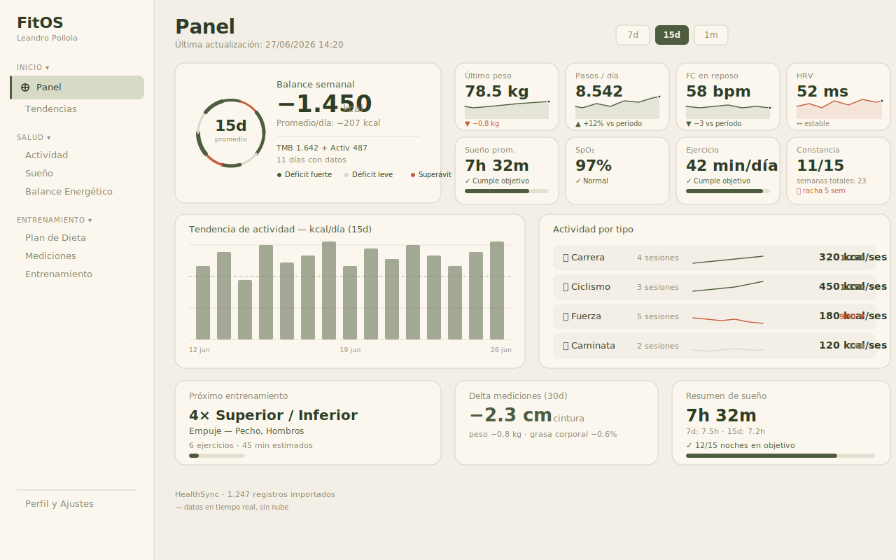
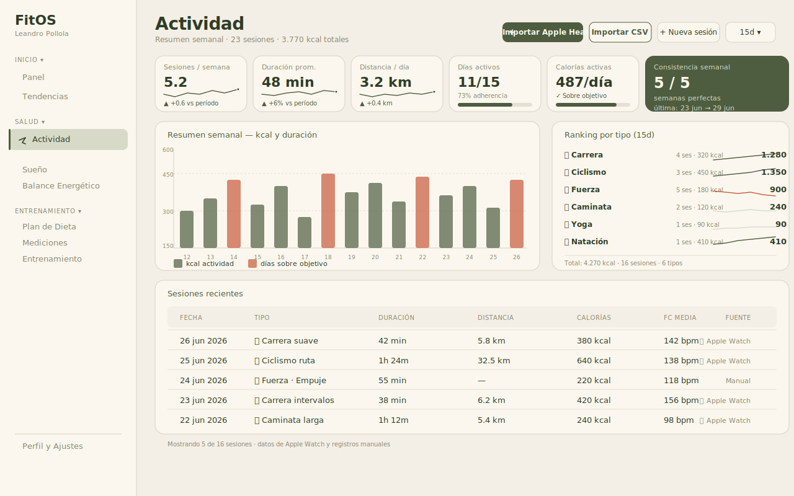
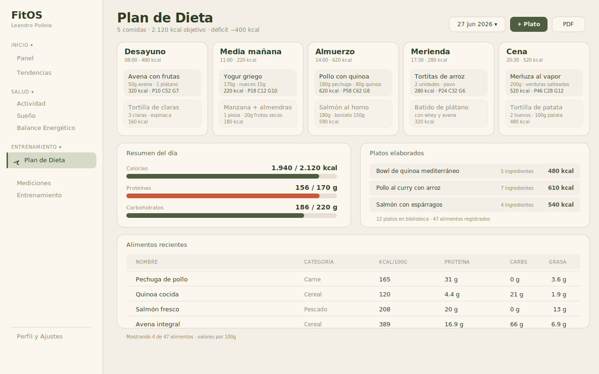
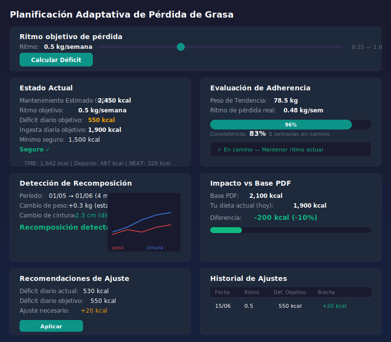
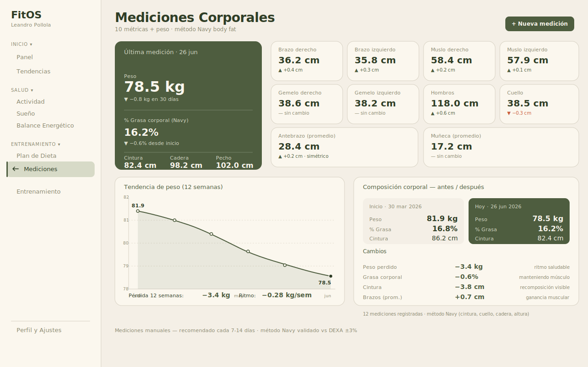
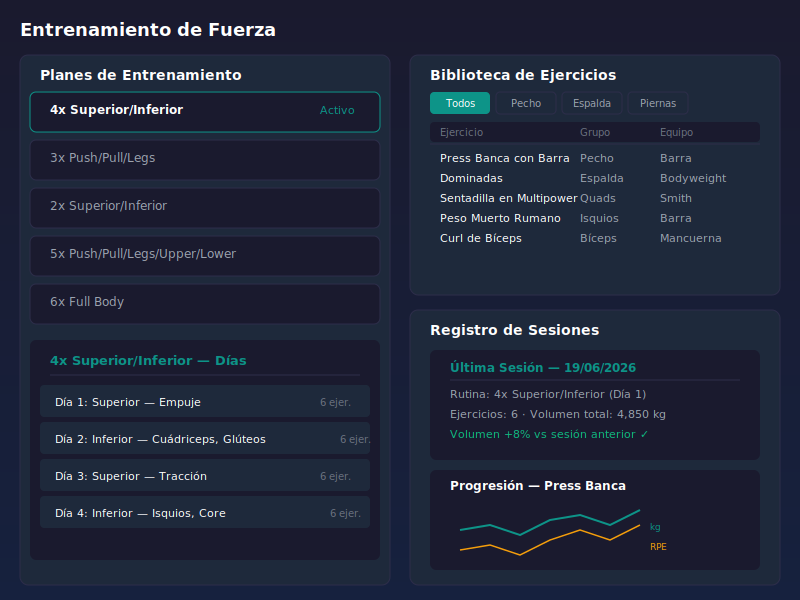

<div align="center">

# 🌿 FitOS

### Acompañante Adaptativo de Nutrición y Entrenamiento

**App de escritorio local-first** — Electron + SQLite — para unificar datos de **Apple Watch**, plan de dieta por slots, balance energético con GET real, mediciones corporales y entrenamiento de fuerza.

**Cero dependencias cloud. Todo corre localmente. Tus datos, siempre tuyos.**

[Comenzar →](#-instalación) · [Vistas →](#-vistas) · [Arquitectura →](#-arquitectura) · [Changelog →](#-changelog)

---


</div>

---

## 🖼️ Capturas

Diseño orgánico "libreta de campo" — paleta moss / bone / ember, tipografía Fraunces + Source Sans 3, textura de papel y anillo de crecimiento como firma visual.

<table>
  <tr>
    <td width="50%"><strong>Panel</strong></td>
    <td width="50%"><strong>Actividad</strong></td>
  </tr>
  <tr>
    <td></td>
    <td></td>
  </tr>
  <tr>
    <td><strong>Plan de Dieta</strong></td>
    <td><strong>Balance Energético</strong></td>
  </tr>
  <tr>
    <td></td>
    <td></td>
  </tr>
  <tr>
    <td><strong>Mediciones Corporales</strong></td>
    <td><strong>Entrenamiento de Fuerza</strong></td>
  </tr>
  <tr>
    <td></td>
    <td></td>
  </tr>
</table>

---

## ✨ ¿Qué hace FitOS?

FitOS convierte datos reales de actividad y mediciones en decisiones semanales del plan de dieta. Conecta Apple Health con tu progreso físico y responde preguntas concretas:

| Pregunta | Dónde se responde |
|---|---|
| ¿Estoy realmente en déficit calórico? | Balance Energético → gauge de adherencia |
| ¿Mi entrenamiento está alineado con mi recuperación? | Entrenamiento + Tendencias → HRV y FC reposo |
| ¿Debería reducir carbohidratos o grasas? | Dieta → plan adaptativo desde déficit objetivo |
| ¿Estoy perdiendo grasa o músculo? | Mediciones → método Navy body fat + histórico |

---

## 🌿 Diseño orgánico 

FitOS adopta una identidad visual intencional — **no es el template SaaS de Inter + slate + teal**. La estética evoca una libreta de campo de un cuerpo vivo:

- **Paleta** — `bone` `#F4EFE6` (fondo), `paper` `#FBF7EE` (tarjetas), `moss` `#4E5D3F` (acento), `moss-ink` `#2F3D26` (títulos), `ember` `#C75B3B` (alerta), `lichen` `#8A8870` (texto secundario)
- **Tipografía** — **Fraunces** (títulos, con cursiva para "etiquetas" de sección) + **Source Sans 3** (cuerpo)
- **Textura** — grano de papel sutil vía `feTurbulence` a 4% opacidad
- **Firma** — anillo de crecimiento con 15 segmentos de radio variable, hueco dinámico según N
- **Easing** — `cubic-bezier(.2, .85, .25, 1)` para todas las transiciones (curva orgánica, no lineal)
- **Acentos** — sin emojis, sin gradientes SaaS, sin barras superiores `linear-gradient(accent, success)`

Tokens definidos en `body.organic` y propagados a las 9 vistas via `#view-<nombre>`.

---

## 🖥️ Vistas (11)

| Vista | ID | Qué verás |
|---|---|---|
| **Panel** | `dashboard` | Hero con anillo de crecimiento + balance semanal grande con desglose de energía; sparklines en KPIs (peso, pasos, FC reposo, HRV, sueño, SpO₂, ejercicio); selector 7d/15d/1m/3m; paneles Strava (PRs por deporte, esfuerzo relativo, registro de entrenamiento, streak + calendario); auto-insights; goals summary |
| **Patrones** | `insights` | Heatmap año en movimiento, día típico de la semana, distribución de deportes (donut + métricas), score de recuperación (HRV + FC reposo + sueño), velocidad de peso, ratio cintura-cadera, auto-insights |
| **Tendencias** | `analytics` | Visión global de salud: pasos, FC, energía, HRV, sueño con gráficos reactivos al periodo (7d/15d/1m/3m/año), agrupación semanal/mensual, KPIs de contexto, flechas de tendencia |
| **Actividad** | `activity` | Importación Apple Health XML + CSV con un solo botón "Sincronizar", detección de anomalías, resumen semanal con gráfico dual kcal/duración, ranking ordenable con sparklines, comparación 15d/1m/3m |
| **Sueño** | `sleep` | Duración, fases (profundo/REM/ligero), consistencia 7d/15d, cumplimiento vs objetivo |
| **Plan de Dieta** | `diet` | 5 columnas de comidas con opciones clickables, gestor de alimentos con paginación y filtros, platos elaborados, auto-generador de plan desde déficit objetivo |
| **Balance Energético** | `energy` | Desglose GET (TMB + deporte + NEAT) en barras apiladas, gauge de adherencia semicircular, balance semanal con target −400 kcal, detección de recomposición |
| **Mediciones** | `measurements` | 10 métricas + peso, método Navy body fat, charts históricos, comparativa antes/después con delta por métrica |
| **Entrenamiento** | `training` | 5 planes predefinidos (2x–6x semana), biblioteca de 55 ejercicios con filtros, registro de sesiones con series/reps/RPE, gráficos de progresión |
| **Perfil** | `profile` | Perfil usuario (edad, sexo, altura, peso), export/import JSON completo, umbrales de cumplimiento |
| **Objetivos** | `goals` | Metas configurables con anillos de progreso (peso, distancia, frecuencia, personalizado), cuenta regresiva por fecha límite, celebración con confeti al completar, resumen compacto en el Panel con hasta 3 anillos clickables |

---

## 🛠️ Stack Técnico

| Capa | Tecnología | Detalle |
|---|---|---|
| **Desktop** | Electron 28.1 | `contextIsolation: true`, `nodeIntegration: false` |
| **Frontend** | Vanilla JS (ES modules) + Vite 5 | Sin frameworks, router manual de 30 líneas |
| **UI** | Chart.js 4.4 + Lucide SVG | 20 íconos tree-shakeados, microcharts reutilizables |
| **Tipografía** | Fraunces + Source Sans 3 | Cargadas via Google Fonts, fallback a Georgia/Inter |
| **Base de datos** | better-sqlite3 9.6 | SQLite WAL mode, foreign keys ON, schema v5 |
| **Tests** | Vitest + jsdom | 299 tests en 32 archivos: unitarios + smoke |
| **Salud** | HealthSync CLI (Go) | Parseo de XML Apple Health |
| **Build** | Vite + electron-builder | AppImage / NSIS / dmg |

---

## 🚀 Instalación

```bash
git clone https://github.com/lnpollola/fitos.git
cd fitos

npm install

npm run dev          # Electron + Vite concurrente
npm run dev:web      # Solo frontend en navegador (sin Electron)
npm test             # 299 tests
npm run build        # Vite build + electron-builder
```

> Si `better-sqlite3` falla con `NODE_MODULE_VERSION`, recompilá con:
> `npx @electron/rebuild -o better-sqlite3`

---

## 🏗️ Arquitectura

FitOS está construido en **4 capas estrictamente separadas**. Cada capa tiene una responsabilidad única y se comunica con la siguiente solo a través de canales definidos.

```
┌───────────────────────────────────────────────────────────┐
│  renderer/  (Vista)                                       │
│  app.js · views/ · utils/ · locales/ · styles/            │
│  SPA vanilla JS · router manual · tokens body.organic     │
├───────────────────────────────────────────────────────────┤
│  preload/  (Puente)                                       │
│  preload.js · contextBridge · IPC calls · domain events   │
├───────────────────────────────────────────────────────────┤
│  main/  (Lógica)                                          │
│  handlers/     · ipc-handlers.js · apple-health-import.js │
│  11 módulos por dominio — patrón register(ipcMain, ...)   │
├───────────────────────────────────────────────────────────┤
│  db/  (Datos)                                             │
│  database.js · seed-data.js · import-export.js            │
│  SQLite WAL · schema v5 · migraciones · populateCache()   │
└───────────────────────────────────────────────────────────┘
```

### Por qué 4 capas

Electron tiene un modelo de seguridad particular: el **renderer** (lo que ve el usuario) corre en un contexto aislado sin acceso directo al sistema ni a Node.js. Toda comunicación con el SO o la base de datos pasa por el **main process** mediante IPC. Esto obliga a separar vista de lógica, y esa separación se extiende a toda la arquitectura:

| Capa | Rol | Decisión de diseño |
|---|---|---|
| `renderer/` | Interfaz de usuario | Vanilla JS sin framework — sin migraciones futuras, cada vista exporta `init()` |
| `preload/` | Puente de seguridad | `contextBridge` expone solo funciones necesarias. Cero lógica de negocio |
| `main/` | Lógica de negocio | 11 módulos por dominio — `ipc-handlers.js` mantiene 30 líneas |
| `db/` | Persistencia y modelo | SQLite con migraciones versionadas, foreign keys, WAL mode y caches agregados |

### Flujo de datos — ejemplo concreto

Cuando un usuario guarda un alimento en la vista Dieta:

```
1. renderer/views/diet.js
   → api.saveFoodItem({ name: "Pollo", kcal: 165 })
   ↓ (IPC message)

2. preload/preload.js
   → ipcRenderer.invoke('db:saveFoodItem', data)
   ↓ (IPC invoke)

3. main/handlers/diet-handlers.js
   → db.saveFoodItem(data)
   → notifyDomain('diet')       // avisa al cliente que los datos cambiaron
   → refreshCaches(7, 15, 30)   // actualiza caches agregados
   ↓ (better-sqlite3)

4. db/database.js
   → INSERT INTO food_items ... RETURNING id
   → populateCache(7) INSERT OR REPLACE INTO activity_summary_cache ...
   ↓ (IPC reply)

5. renderer
   → cacheStore.invalidate('diet')   // invalida caché local del dominio
   → Repinta solo la sección afectada
```

### Sistema de caché en dos niveles

| Caché | Ubicación | TTL | Propósito |
|---|---|---|---|
| **Cliente** | `renderer/utils/cache-store.js` (Map en memoria) | 30s + invalidación por evento | Evita llamadas IPC innecesarias al navegar entre vistas |
| **Servidor** | `activity_summary_cache` en SQLite | Persistente | Agregaciones precomputadas (7/15/30 días) para el dashboard; incluye 8 métricas HealthSync |

La caché de servidor acelera consultas pesadas (dashboard con múltiples agregaciones). La de cliente evita viajes IPC redundantes cuando los datos no cambiaron. Ambas se invalidan coordinadamente vía `notifyDomain` + `EventTarget`.

### CSS modular

`main.css` se compone de 7 archivos con el **mismo hash de bundle** que el monolítico original:

| Archivo | Contenido |
|---|---|
| `base.css` | CSS reset, custom properties, tipografía Fraunces + Source Sans 3, tokens `body.organic`, textura de papel |
| `layout.css` | Sidebar, grid principal, responsive breakpoints (375px / 900px / 1280px) |
| `cards.css` | `.card`, `.card-accent`, hero colapsable, skeletons animados, contenedores sparkline |
| `forms.css` | `.form-group`, inputs, botones, checkboxes, spinners |
| `tables.css` | `.data-table`, sticky headers, alineación de celdas |
| `utilities.css` | `.text-xs`, `.flex-gap-sm`, `.sr-only`, colores de estado |
| `insights.css` | Estilos específicos para la vista de Patrones (heatmap, donut, recovery) |

---

## 📂 Estructura del Proyecto

```
src/
├── renderer/                  # Frontend SPA
│   ├── index.html             # Shell HTML con sidebar navegable
│   ├── app.js                 # Router manual, init global, eventos
│   ├── views/                 # 11 vistas — cada una exporta init()
│   │   ├── dashboard.js
│   │   ├── insights.js
│   │   ├── activity.js
│   │   ├── diet.js
│   │   ├── energy.js
│   │   ├── sleep.js
│   │   ├── measurements.js
│   │   ├── training.js
│   │   ├── analytics.js
│   │   ├── profile.js
│   │   └── goals.js
│   ├── locales/
│   │   └── es.js              # ~650 strings organizados por dominio
│   ├── utils/                 # Utilidades reutilizables
│   │   ├── cache-store.js     # Map + TTL 30s + invalidación por dominio
│   │   ├── sparkline.js       # Microchart sparkline con Catmull-Rom
│   │   ├── growth-ring.js     # Anillo de crecimiento con gap dinámico
│   │   ├── icons.js           # 20 íconos Lucide tree-shakeados
│   │   ├── sport-icons.js     # Mapeo deporte → Lucide
│   │   ├── chart-theme.js     # Tema compartido para Chart.js
│   │   ├── bmr.js             # Cálculo TMB Mifflin-St Jeor
│   │   ├── body-fat.js        # Método Navy body fat
│   │   ├── skeleton.js        # Skeletons animados por tipo
│   │   ├── state-card.js      # Sistema tri-estado loading/empty/error
│   │   ├── validation.js      # Validación de formularios
│   │   ├── goal-progress-ring.js  # SVG donut de progreso configurable
│   │   ├── goals.js           # Helpers: progreso, cuenta regresiva, filtros
│   │   ├── confetti.js        # Animación canvas de confeti
│   │   └── kpi-derivation.js  # Cálculos derivados: pace projection, effort, streak
│   └── styles/                # CSS modular (7 archivos + main)
│       ├── main.css           # Solo @imports en orden de cascada
│       ├── base.css
│       ├── layout.css
│       ├── cards.css
│       ├── forms.css
│       ├── tables.css
│       ├── utilities.css
│       └── insights.css
│
├── preload/
│   └── preload.js             # contextBridge, exposición IPC
│
├── main/
│   ├── main.js                # Ventana Electron, menú nativo
│   ├── ipc-handlers.js        # Registro de 11 módulos (30 líneas)
│   ├── apple-health-import.js
│   ├── healthsync-cli.js
│   └── handlers/              # Handlers IPC por dominio
│       ├── activity-handlers.js
│       ├── diet-handlers.js
│       ├── energy-handlers.js
│       ├── measurements-handlers.js
│       ├── training-handlers.js
│       ├── profile-handlers.js
│       ├── dashboard-handlers.js
│       ├── health-handlers.js
│       ├── settings-handlers.js
│       ├── goals-handlers.js
│       └── insights-handlers.js
│
├── db/
│   ├── database.js            # Schema v5, migraciones, populateCache
│   ├── seed-data.js           # 198 alimentos, 55 ejercicios, 5 planes fuerza + 12 planes HIIT/WOD/METCON
│   └── import-export.js       # Backup/restore JSON completo
│
├── scripts/
│   ├── sync-healthsync.js
│   └── reset-healthsync.js
│
└── tests/
    ├── unit/                  # 24 archivos de tests unitarios
    └── smoke/                 # 8 tests de integración de vistas
```

---

## 💡 Principios del Producto

- **GET basado en actividades reales** — deportivas + NEAT, no multiplicadores genéricos
- **Modelo de dieta estructurado** — basado en planes probados con slots de comidas
- **Revisión semanal, no diaria** — decisiones sobre promedios, no sobre ruido diario
- **Las mediciones cuentan la historia completa** — no solo la báscula
- **Déficit y progresión seguros por defecto** — valores conservadores out-of-the-box
- **Cero cloud** — datos locales siempre, exportables en JSON en cualquier momento
- **Estética intencional** — la "libreta de campo" reduce la fricción cognitiva y se aleja del template SaaS
- **Insights accionables** — la vista Patrones convierte datos crudos en narrativas de patrones ("tu mejor semana en 3 meses", "los lunes corres 28% más")

---

## 📦 Changelog

### v0.7.0 — Insights y Refinamiento UX *(8 Jul 2026)*

- **Nueva vista: Patrones** (`insights`) — análisis de patrones de entrenamiento y recuperación con 7 secciones: heatmap año en movimiento, día típico de la semana, distribución de deportes, score de recuperación, velocidad de peso, ratio cintura-cadera, y auto-insights
- **Panel UX/UI mejorado** — sparklines en KPIs, balance semanal con desglose de calorías, último peso visible, explicación de HRV/FCR, streak + calendario combinados, auto-insights integrados
- **Strength training insights** — 1RM estimado (Epley), PRs por ejercicio, detección de mesetas, score de fuerza por grupo muscular, tendencia de volumen semanal
- **Apple Health data integrity** — un solo botón "Sincronizar", validación de binario, detección de anomalías, reset & re-sincronizar, progreso en tiempo real
- **Tendencias refinadas** — gráficos reactivos al periodo (7d/1m/3m), flechas de tendencia junto al valor, KPIs de contexto en energía, selector 15d, agrupación semanal/mensual
- **Objetivos mejorados** — fix de cálculo de progreso, botones de acción más visibles, mejor integración con el dashboard
- **Codebase cleanup** — eliminación de 25 preload APIs sin usar, ~200 líneas CSS duplicado, micro-mejoras de UX (tooltips, keyboard navigation, transiciones)
- **32 archivos de tests** — 299 tests pasando (unitarios + smoke)

### v0.6.0 — Goals Tracker *(27 Jun 2026)*

- **Nueva vista: Objetivos** (`goals`) — metas configurables con 4 tipos: peso corporal, distancia, frecuencia semanal y personalizado
- **Anillos de progreso SVG** — `goalProgressRing()` en `utils/goal-progress-ring.js`, donut configurable con color verde (<100%) y ámbar (≥100%, overshoot)
- **Cuenta regresiva** — días restantes con codificación por urgencia: normal (>30 días), próximo (8–30), urgente (≤7)
- **Celebración con confeti** — animación Canvas (150–300 partículas) al completar un objetivo, overlay con mensaje "¡Objetivo conseguido!"
- **CRUD completo** — crear, editar, archivar y eliminar objetivos. Persistencia como JSON en tabla `settings` (clave `goals`), sin cambios de schema
- **Card resumen en el Panel** — hasta 3 anillos compactos (56×56 px) entre los paneles Strava y el hero de balance energético, clickeables para navegar a Objetivos
- **6 IPC handlers nuevos** — `db:getGoals`, `db:saveGoal`, `db:deleteGoal`, `db:archiveGoal`, `db:getGoalProgress` en `src/main/handlers/goals-handlers.js`
- **3 utilidades nuevas** — `goal-progress-ring.js`, `goals.js` (helpers puros), `confetti.js` (animación canvas)
- **299 tests** (30 archivos) — 23 tests nuevos, 0 regresiones

### v0.5.0 — Crecimiento, integridad y refinamiento *(27 Jun 2026)*

- **Apple Health data integrity** — validación binaria en import, deduplicación de registros por `external_id`, comando `npm run reset:healthsync` para limpiar duplicados
- **Dashboard consistency badge** — total de semanas registradas + racha actual (semanas perfectas consecutivas)
- **HealthSync CLI como único punto de entrada** — un solo botón, un solo flujo, sin scripts sueltos
- **KPIs refinados** — pasos/día, HRV, SpO₂, sueño prom., FC reposo, ejercicio, consistencia
- **9 vistas** — se agrega Sueño (`sleep`) como vista dedicada
- **127 tests** (21 archivos)
- **Estética orgánica "libreta de campo"** ya consolidada en todas las vistas (dashboard, activity, diet, energy, sleep, measurements, training, analytics, profile)

### v0.4.0 — Arquitectura Modular *(23 Jun 2026)*

- **Handlers IPC modulares** — 9 módulos por dominio en `src/main/handlers/` con patrón `register(ipcMain, getDb, getHS, notifyDomain)`. `ipc-handlers.js` pasó de 1.372 a 30 líneas
- **Caché cliente** — `cache-store.js` con Map + TTL 30s + invalidación por dominio vía `EventTarget`. Las vistas reciben eventos `domain-changed` para refrescar sin recargar la app
- **Caché HealthSync** — `activity_summary_cache` con partición `period_days` (7/15/30) y 7 métricas nuevas
- **CSS modular** — `main.css` reducido a imports; 6 archivos por componente con el mismo hash de bundle que el monolítico
- **104 tests** (20 archivos)

### v0.3.0 — Diseño Orgánico "Libreta de Campo" *(22 Jun 2026)*

- **Identidad visual** — tipografía Fraunces (títulos) + Source Sans 3 (cuerpo). Paleta `moss #4E5D3F` / `bone #F4EFE6` / `ember #C75B3B` / `lichen #8A8870`
- **Microcharts reutilizables** — `sparkline()` y `growthRing()` como módulos independientes en `utils/`. Anillo de crecimiento con gap dinámico (0° para N≤14, 0.6° para N>14)
- **Tokens globales** — variables CSS promovidas de `#view-dashboard` a `body.organic` y propagadas a las 9 vistas
- **Textura de papel** — `feTurbulence` SVG a 4% opacidad sobre `body.organic::before`
- **Easing orgánico** — `cubic-bezier(.2, .85, .25, 1)` para todas las transiciones
- **52 tests**

### v0.2.0 — UI/UX Overhaul *(20 Jun 2026)*

- **Sistema de diseño** — tokens de espaciado (`--space-1..8`), elevación (`--shadow-lg`), z-index; clases utilitarias y de componente
- **Íconos SVG (Lucide)** — todos los emojis reemplazados por SVGs; 20 iconos tree-shakeados con mapeo deporte → Lucide
- **Skeletons y streaming** — esqueletos animados en las 9 vistas; `Promise.allSettled` para mostrar cards ni bien resuelven
- **Responsive** — 3 breakpoints (<900px colapsa sidebar a iconos, 901–1280px normal, >1280px expandido)
- **Estados loading/empty/error** — sistema tri-estado con `state-card.js`, `role="alert"` en errores y botón "Reintentar"
- **Accesibilidad** — sidebar con `<button>` nativos, `aria-current="page"`, `:focus-visible`, `role="navigation"`
- **38 tests**, 13 bugs corregidos, `safeCall` wrapper en vistas

### v0.1.0 — Fundación *(18 Jun 2026)*

- 8 vistas funcionales: Panel, Actividad, Dieta, Balance Energético, Mediciones, Entrenamiento, Tendencias, Perfil
- Integración Apple Health XML via HealthSync CLI
- Plan de dieta con slots, alimentos, platos elaborados, auto-generador desde déficit
- Balance energético con GET real (TMB Mifflin-St Jeor + NEAT + deporte)
- 5 planes de entrenamiento predefinidos (2x–6x semana), 55 ejercicios, registro RPE
- Mediciones corporales con 10 métricas + método Navy body fat
- Export/import JSON completo
- 22 tests

---

## 🤝 Contribuir

Las specs viven en `openspec/specs/` en formato Gherkin. Cada cambio sigue el ciclo:

```
opsx-explore → opsx-propose → opsx-apply → opsx-archive
```

Los comandos están en `.opencode/commands/opsx-*.md`. Antes de proponer un cambio, leé [`openspec/specs/spec.md`](openspec/specs/spec.md).

### Guía rápida para contribuciones

1. **Explorar** — Usá `/opsx-explore` para investigar el problema y definir el alcance
2. **Proponer** — Usá `/opsx-propose` para generar el proposal con specs y tasks
3. **Implementar** — Usá `/opsx-apply` para ejecutar las tasks contra las specs
4. **Archivar** — Usá `/opsx-archive` para fusionar las specs y archivar el cambio

### Estructura de un cambio

```
openspec/changes/archive/<fecha>-<nombre>/
├── proposal.md          # Por qué y qué cambia
├── design.md            # Decisiones técnicas
├── specs/               # Delta specs (Gherkin)
└── tasks.md             # Lista de tareas
```

### Tests

Todos los cambios deben mantener o mejorar la cobertura de tests:

```bash
npm test                 # 299 tests (unitarios + smoke)
```

Antes de hacer commit, aseguráte de que:
- Todos los tests pasan
- El build funciona (`npm run build`)
- No hay regresiones en las vistas existentes

---

## 📄 Licencia

MIT © Leandro Pollola — Ver [`LICENSE`](LICENSE) para más detalles.

---

<div align="center">
<sub>Construido con 🌿 en Valencia · Local-first, sin cloud, sin dependencias externas</sub>
<br>
<sub>11 vistas · 299 tests · 11 módulos de handlers · Diseño orgánico "libreta de campo"</sub>
</div>
